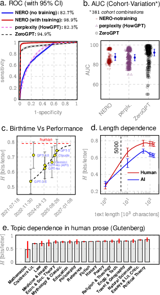

# NERO binary

```
╔╗╔╔═╗╦═╗╔═╗
║║║║╣ ╠╦╝║ ║
╝╚╝╚═╝╩╚═╚═╝
Copyright paraknowledge corporation 2023
author ishanu chattopadhyay ishanu@paraknowledge.ai
```


```
Usage: nerotxt -f <datafile> 


Cmdline Args.(param. may be set in <configfile>):
  -h [ --help ]                     print help message.
  -c [ --configfile ] arg           config file
  -f [ --datafile ] arg             data file
  -r [ --rawmode ] arg              if true, datafile is pdf/txt [true]
  -x [ --datalen ] arg              length max for input sequence
  -T [ --datatype ] arg             data type: continous or symbolic
  -D [ --datadir ] arg              data direction: row or column
  -w [ --syncstring ] arg           sync string
  -P [ --partition ] arg            partition
  -u [ --use_derivative ] arg       use derivative [false]
  -e [ --epsilon ] arg              merging resolution [0.000001]
  -q [ --prevalence ] arg           prevalence of positives [0.5]
  -R [ --reruns ] arg               # of reruns with random starts [30]
  -m [ --min-occurrence ] arg       min. # of occurrences of string [20]
  -M [ --min-occurrence-range ] arg min. occurence range  0 to this  [40]
  -d [ --max-depth ] arg            summation depth [10000000]
  -v [ --verbose ] arg              verbose output for value >0
  -o [ --outfile ] arg              Output json file to write results
  -V [ --version ]                  print version number

```


